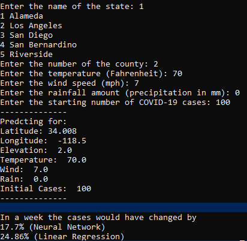

# CS 175 Final Project: Analysis of COVID-19 Infection Rates and Weather Patterns

Team: Jose Maldonado, Nomin Amgalan, Joshua Si

## Running Code:

Make sure [Python 3](https://www.python.org/downloads/) is installed

To ensure all requirements are installed, run:
```pip3 install -r requirements.txt```

To run our sample source, open predictingCases.py:
```python3 predictingCases```

Proceed to enter input, and it will return predictions on COVID-19 growth rates using our Neural Network and Linear Regression models.



## Sources:

Amit, Tomer. “Machine Learning & The Coronavirus.” Medium, Towards Data Science, 21 Mar. 2020, towardsdatascience.com/machine-learning-the-coronavirus-9cb8352e1b36.

Baragona, Steve. “Will Warmer Weather Slow COVID-19 Spread?” Voice of America, Voa News, 12 May 2020, www.voanews.com/covid-19-pandemic/will-warmer-weather-slow-covid-19-spread.

“COVID19 Global Forecasting (Week 1).” Kaggle, Kaggle, 19 Mar. 2020, www.kaggle.com/c/covid19-global-forecasting-week-1/data.

“COVID19 Global Forecasting (Week 2).” Kaggle, Kaggle, 26 Mar. 2020, www.kaggle.com/c/covid19-global-forecasting-week-2

“COVID19 Global Forecasting (Week 3).” Kaggle, Kaggle, 2 April 2020, www.kaggle.com/c/covid19-global-forecasting-week-3

“COVID19 Global Forecasting (Week 4).” Kaggle, Kaggle, 9 April 2020, www.kaggle.com/c/covid19-global-forecasting-week-4

davidbnn92. “Weather Data.” Kaggle, Kaggle, 12 Apr. 2020, www.kaggle.com/davidbnn92/weather-data.

designer, JHCHS website. “Situation Reports on the Novel Coronavirus Identified in China.” Johns Hopkins Center for Health Security, 3 June 2020, www.centerforhealthsecurity.org/resources/COVID-19/COVID-19-SituationReports.html.

Powell, Alvin. “Warm Weather May Have No Impact on COVID-19.” Harvard Gazette, 14 Apr. 2020, news.harvard.edu/gazette/story/2020/04/covid-19-may-not-go-away-in-warmer-weather-as-do-colds.

Almukhtar, S et al. (2020, March 03). Coronavirus in the U.S.: Latest Map and Case Count. Retrieved June 06, 2020, from https://www.nytimes.com/interactive/2020/us/coronavirus-us-cases.html

Smith et al. “Nytimes/Covid-19-Data.” GitHub, 6 June 2020, github.com/nytimes/covid-19-data.
